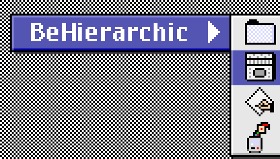

# BeHierarchic



**The Retrocomputing Archivist's File Server**

BeHierarchic exposes the inside of several Apple-adjacent archive types as a plain directory, like so:

```
Apple_Developer_Discs_1989-2009/
    1997/
        System Software/
            Dev.CD Nov 97 SSW.toast◆/
                Apple_HFS,TOAST 2.5 Partition◆/
                    Dev.CD Nov 97 SSW/
                        Utilities/
                            SimpleText
```

## Get started

```
go install github.com/elliotnunn/BeHierarchic@latest
BeHierarchic :1997 ~/mysoftwarecollection
```

On a Mac: ⌘K and connect to http://127.0.0.1:1997
On Windows: navigate Windows Explorer to http://127.0.0.1:1997

Supported compression/archive/image types include:

- Zip
- StuffIt
- HFS (Apple's old old Mac filesystem)
- tar
- gzip/bzip2/xz
- more to come!

## Bugs

- The automatic startup scan takes a *long* time... but you can still browse during the scan, just slower
- Memory tuning. On a server with 32 GiB RAM these environment variables work well: `BEGB=16 GOMEMLIMIT=20GiB`
